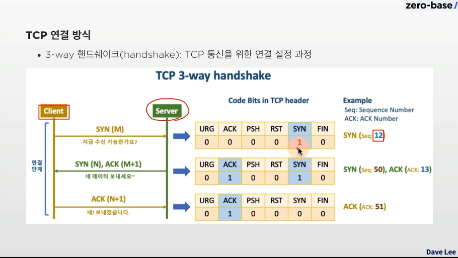
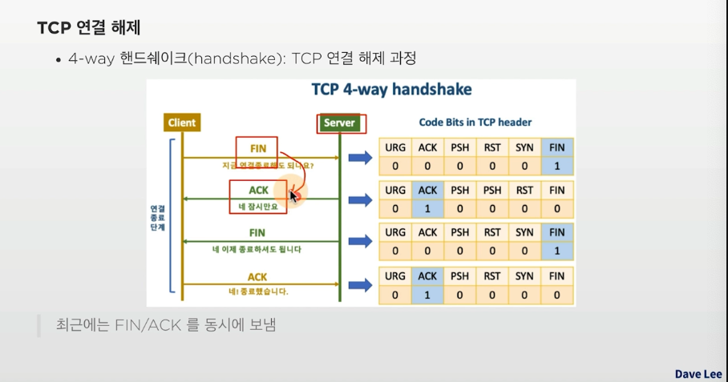

# Network

## intro

- 챕터의 목표 (대비하는 면접 질문)

1. OSI 7계층에 대해 간략히 설명해주세요
2. TCP와 UDP의 차이점과 장단점에 대해서 설명해주세요
3. 채팅 서버-클라이언트간에는 TCP와 UDP 중 어떤 프로토콜을 사용하는 것이 좋을지에 대해 가능한 구체적으로 설명해주세요

## 프로토콜 & OSI 7 Layer

### 물리계층

- 데이터 전기신호를 변환하여 송수신

### 데이터링크계층

- 물리적 네트워크 사이의 데이터 송수신 담당
- 대표적인 프로토콜 : Ethernet프로토콜
- 데이터 단위 : 프레임

### 네트워크 계층

- 다양하고 방대한 네트워크 상에서, 컴퓨터간 논리적 연결을 위해 네트워크 계층이 필요
- 대표적인 프로토콜 : IP프로토콜
- 데이터 단위 : 패킷

### 전송계층

- 목적지에 신뢰할 수 있는 데이터 전달 담당
  - 데이터 전송 중 손상 / 유실 확인을 위한 오류 점검 (체크섬)
- 목적지의 어떤 응용프로그램에 데이터를 전달해야하는지 식별
- 대표적 프로토콜 (TCP, UDP)

#### TCP vs UDP

- TCP: 연결형 프로토콜, 데이터의 전송순서 보장, 데이터 신뢰성 보장
- UDP: 비연결형 프로토콜, TCP보다 전송속도 빠름, 주로 스트리밍/ 브로드캐스팅 서비스
  - UDP 데이터는 데이터 그램이라고 부름(패킷으로 부르지 않음)

#### port 번호

- 목적지의 어떤 응용프로그램에 데이터를 전달해야하 하는지를 식별하는 기능
- 포트번호는 0 ~ 65535

### 세션 계층

- 세션 또는 대화 연결, 관리담당
- ex) FTP로 여러 파일을 각각 다운로드 받을 때, 각 다운로드 연결 / 관리 처리

### 표현 계층

- 응용 계층으로부터 전달받거나, 전달하는 데이터의 암호화 담당

### 응용 계층

- 네트워크 응용 프로그램을 위한 인터페이스 제공
- 대표적인 프로토콜: HTTP

## TCP IP 모델

- 인터넷 통신을 위한 모델
- OSI 7 Layer는 표준모델, 현실에서 인터넷을 위해 사용하는 모델은 TCP/IP 모델
- TCP/IP모델의 응용 계층은 OSI 모델의 세션+표현+응용 계층 통합

> 단골 CS 네트워크 지식 문항
>
> s 1. TCP의 3-way-handshake와 4-way-handshake의 방식의 차이점에 대해 간략히 설명해주세요 2. TCP와 UDP의 차이점과 장단점에 대해서 설명해 주세요

### IP

#### IPv4

- 8 bit \* 4(2^32개 IP주소)

- 자기 PC의 IP주소: 127.0.0.1 (DNS로는 localhost)

- DHCP(동적 호스트 구성 프로토콜), NAT, VLAN을 통해 주소 해결

#### IPv6

## TCP

### TCP 프로토콜

### TCP 연결방식

- 3-way handshake : TCP 통신을 위한 연결 설정 과정
  
- 4-way handshake : TPC 연결 해제 과정
  

### TCP 제어

> 네트워크 트래픽에 따른 효율적 / 신뢰적 송신을 위한 제어 알고리즘

- 흐름제어 (Flow Control): Sliding Window

  - 매번 ACK를 기다리지 않고 여러 패킷을 연속해서 송신하기 위해
  - 각 컴퓨터의 윈도우 사이즈를 확인하고, 윈도우 사이즈만큼 ACK없이 연속해서 송신

  - 요즘에는 RTT(Round Trip Time)을 측정하여 바로 윈도우 사이즈를 재설정
    (송신측과 수신측 모두 자신의 윈도우 사이즈를 65535로 설정)

- 혼잡제어 (Congestion Control)

  - 송신제어를 위한 윈도우는 2개

    - Receiver Window(RWND): 흐름제어(Sliding Window)에서 활용
    - Congestion Window(CWND): 네트워크 혼잡제어를 위해 활용

  - 송신측 최종 윈도우 크기 = min(RWND, CWND)
  - MSS = MTU(Maximum Transmission Unit / 한번 전송 때 보낼 수 있는 최대 단위) - IP헤더길이 - TCP 헤더길이 = 1500-20-20 = 1460 bytes
  - 혼잡제어: AIMD(Addictive Increase / Multicative Decrease)
    - AIMD 처음에는 CWND=1 ACK 가 도착하면 CWND ++;
    - 일정시간 동안 도착하지 않음 = CWND/2
  - 혼잡제어 : slow start 및 혼잡회피

    - slow start
    - 일반적으로 첨음에는 CWND=1
    - ACK 도착하면 CWND= CWND\*2

  - 혼잡 회피
    - slow Stater를 사용하다가 CWND가 일정 크기에 도달하면 CWND= CWND+1

## 다양한 프로토콜

### HTTP

- www란?
  - W3 또는 웹
  - 주요요소 : HTML, URL, HTTP
- HTML : markup 언어, hypertext와 hyperlink로 구성

- Server/Client모델로 Request / Response 사용
  - Client 요청을 보내면, Server에서 응답을 준다.
  - HTTP는 Connectionless 한 프로토콜임 - 1회성 Request 및 Response!
  - TCP/IP socket을 이용해서 연결됨

- HTTP는 Connectionless 방식
- HTTP1.1은 keepalive 기능을 통해, 서버에서 설정된 keepalive timeout 까지는 연결과정 없이 데이터 송수신 가능
  - 내부적으로 결국 매번 TCP 3-way handshake 과정을 거칠 필요가 없어짐

### 인터넷 상에서 정보를 주고받는 프로토콜

### HTTP method
