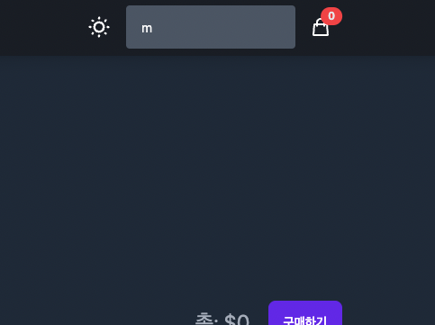

# React Shop

## 사이트 홈페이지

<a href="https://react-shopmall.vercel.app/">
<h3>React Shop</h3>

</a>

## 사용 스택

### Vite

> 번들 할 때 ESBuild를 사용하므로 CRA보다 10-100배 빠르다.
> vite는 개발중에 번들링을 하지 않는다.
> 개발중엔 ES Import를 직접지원하고, 브라우저에서 script module 형태로 불러오기에 별도의 번들링이 필요 없으며, 필요한 파일만 컴파일 하여 메모리에 저장하기에 로딩도 빠르다.

 

### React

- React-router-dom
- React-carousel

### Typescript

> bundler를 사용하는 순간 컴파일하는 동안 오류가 없게 하기위해서는 typescript를 사용할 수 밖에 없게 되었다.

### Recoil

> 리액트의 경우 단방향 바인딩 뷰로 데이터 변화에 따라 성능 저하 없이 DOM 객체를 갱신하고 추적한다.
> 하지만 이러한 상태관리시 props drilling 현상으로 props의 뎁스가 증가하면서 불필요한 리렌더링을 유발할 수 있다.
> Recoil을 통해 store 데이터 공간을 두고 store에 모델처럼 값을 꺼내 쓸 수 있다.
> atom을 구독하면 해당 컴포넌트들만 선택적으로 리렌더링 되며 데이터 캐싱 기능도 자동으로 제공하기에 데이터를 다루기에 용이하다.
> 하지만 디버깅 툴이 잘 제공되어 있지 않아 큰 규모에서 도입하기 힙들다.

- 범위가 크면 Redux 작다면 state, props, 전역적으로 거의 변화가 없는 값은 Context API사용

### Tailwind CSS

> 장점

1. 웹 개발은 이제 대부분 솔루션 방식이 아니라 프론트가 직접 HTML과 CSS를 수정한다.
2. CSS로 개발하는 것보다 HTML을 다루는게 더 편하면서 side-effect가 적다.
3. 하나의 디자인 시스템을 가지고 여러개의 스타일시트를 이용해서 테마를 만들 이유가 없다.
4. BEM 방법론 등에 신경쓰지않고, HTML, CSS를 왔다갔다하며 수정할 필요가 없다.

### Vercel

> Github 계정과 연동하여 손쉽게 배포할 수 있으며, main branch에 merge 시 CI/CD가 구현되어있다.

## 기능

- 다크모드 구현
  

- 검색 기능 구현
  

- 장바구니 기능
  

- 반응형 구현
